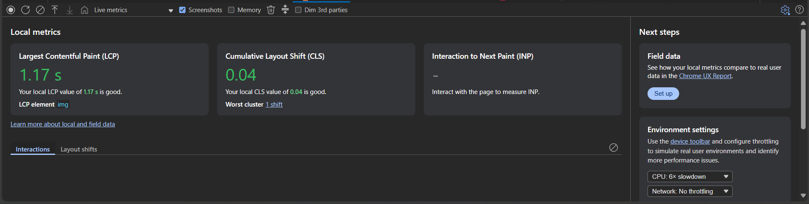
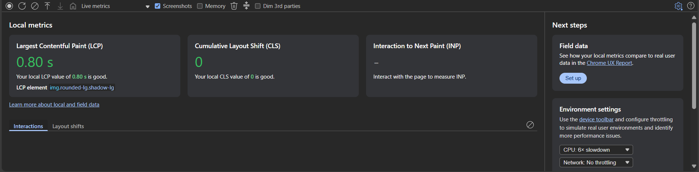
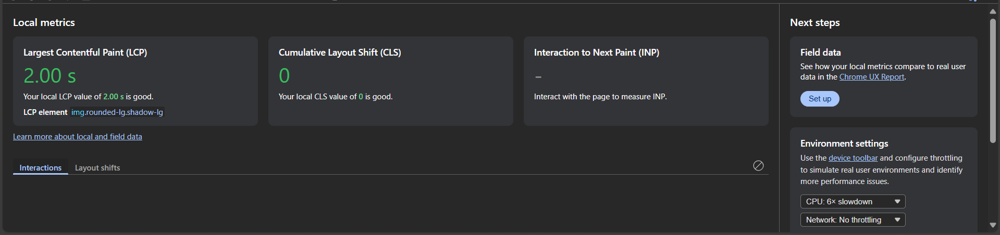

# Client
This `README.md` contains all answers to part 2.

**Before:**

**After:**

## Optimization 1: Lazy loading on image
Only images that are not on the fold are rendered using lazy loading. In addition, this optimization not only improves LCP but also prevents layout shift caused by images that are not loaded yet. It uses `loading="lazy"` attribute on the image tag and further optimized by using `next/image` component from Next.js that improved layout stability.

## Optimization 2: CSS & JS minification
By using Next.js, the CSS and JS files are automatically minified as part of the build process, as well as unused classes from Tailwind CSS. In development build of react, all CSS and JS files are not minified to ease debugging. But during the build process, all JS and CSS files are minified, any unused JS codes are removed by using tree shaking, and unused Tailwind CSS classes are purged, which helps to reduce render-blocking resources. For comparison, this is the metrics before the minification using same test case as after optimization:

## Optimization 3: Reducing render-blocking resources
There are ways to reduce render-blocking resources. One of them is to optimize CSS. By using Tailwind CSS, it helps to reduce render-blocking resources by only generate CSS that is used in the project. By using production build, Tailwind CSS will purge any unused CSS classes and only includes classes that are used in the project.