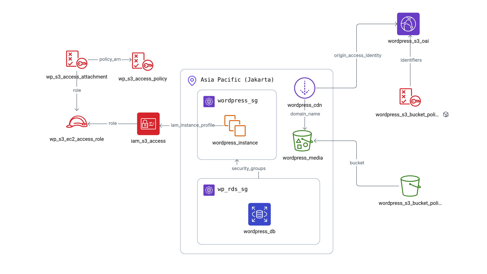

# About this folder (Part 4)
This folder contains terraform code to deploy Wordpress on Amazon Web Services (AWS).



## How to use
1. Install terraform on your local machine. You can find the installation instructions [here](https://learn.hashicorp.com/tutorials/terraform/install-cli).
2. Run the following command to initialize the terraform project:
   ```bash
   terraform init
   ```
3. Then run the following command to see infrastructure changes:
  ```bash
  terraform validate
  terraform plan
  ```
4. If everything looks good, confirm by running the following command:
  ```bash
  terraform apply
  ```

## Infrastructure Setup
This terraform code will create the following resources:
1. EC2 instance `wordpress_instance` with following configurations:
  - AMI: Amazon Linux 2 (You can change this later if required)
  - Instance Type: t2.micro (Free tier eligible)
  - Security Group: Allow HTTP and SSH access
2. RDS instance `wordpress_db` with following configurations:
  - Engine: MySQL
  - Instance Type: db.t2.micro (Free tier eligible)
  - Storage: 20 GB (General Purpose SSD)
  - Security Group: Allow MySQL access from the EC2 instance
3. S3 bucket `wordpress_media` for storing media files
4. CloudFront distribution `wordpress_cdn` for caching and serving static files

## Benefits
1. Because it uses Teraform, infrastructure is defined as a code or IAAC, making it easy to manage in version control.
2. By using IAAC, it is easier to draw the architecture diagram than manually drawing it.
3. It is also easier to maintain the infrastructure by adding or removing resources in the code.
4. This deployment includes setup for wordpress after EC2 instance is up and running for the first time. In the end of the script, it returns the public IP of the EC2 instance, which can be used to access the Wordpress site.
5. This terraform script also include setup for roles and policies for `wordpress_instance` to access `wordpress_media` S3 bucket and `wordpress_db` RDS instance. This is done by creating an IAM role and attaching it to the EC2 instance (see image above), making sure `wordpress_db` is not publicly accessible. This is a good practice for security.